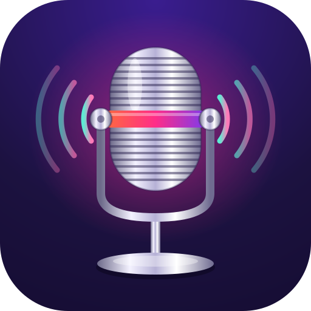
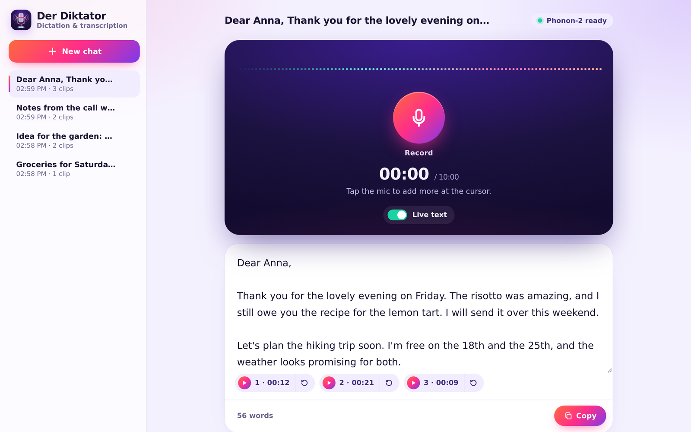
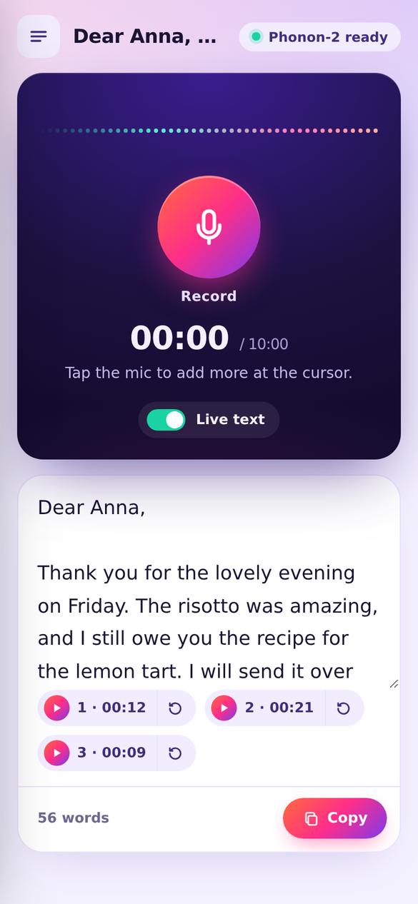

<p align="center">
  
</p>

<h1 align="center">Der Diktator</h1>

<p align="center"><strong>A self-hosted dictation and transcription server.</strong><br />
Dictate snippets from your phone or computer, get editable text,<br />
and keep everything on your own machine.</p>

---

Der Diktator is a small web app for capturing spoken notes, drafts, and ideas as
text. Run it on a home server, open it in the browser on your phone or laptop,
tap the microphone, and speak. Speech is transcribed on the server by the
[Phonon-2](https://huggingface.co/FermionResearch/Phonon-2) model running on the
CPU; your transcripts and recordings are stored there as plain files. No audio or
text is sent to a cloud service.

The intended setup is a machine at home, behind your firewall, that you reach from
anywhere through a private VPN such as [Tailscale](https://tailscale.com/) or
[WireGuard](https://www.wireguard.com/). It also runs on a single computer,
including Windows through WSL2. Phonon-2 recognises English. The name is a play on
words: in German, a _Diktat_ is a dictation.

<p align="center">
  
  &nbsp;
  
</p>

> [!WARNING]
> Der Diktator has **no user accounts, passwords, or access control**. Anyone who
> can reach it can read, change, and delete every chat and recording. Keep it on
> `localhost` or a private network or VPN, and never expose it to the internet
> (no port forwarding, no `tailscale funnel`). It is designed for one person, or
> a household that trusts each other.

> [!NOTE]
> **Experimental.** Der Diktator has been vibe coded with the help of AI coding
> assistants (Claude and Codex). It is a personal project, not a hardened
> product: expect rough edges, review the code before you rely on it, and keep
> backups of transcripts that matter.

## Features

- **Dictate from any device.** A responsive web app for phone, tablet, and
  desktop browsers. Nothing to install on the device.
- **Live transcription.** Text appears while you speak and is finalised when you
  stop. Turn off **Live text** to transcribe once after recording instead.
- **Chats.** Each dictation is a chat: one editable transcript plus every
  recording made for it. Start new chats, reopen old ones, or delete them.
- **Dictate at the cursor.** Recording again never replaces your text. The new
  transcript is inserted at the cursor, or replaces the selected text.
- **Recordings are kept.** Every recording is stored with its chat. Play it
  back, or transcribe it again at the cursor.
- **Autosave and copy.** Edits are saved on the server automatically; **Copy**
  puts the whole transcript on the clipboard.
- **Private.** Transcription runs on your server's CPU, with no cloud services
  and no GPU required.
- **Resilient.** If live transcription drops, the complete recording is
  transcribed when you stop. If a recording cannot be stored, it stays in the
  tab so you can retry.

## How to use it

1. **Open the app** in your browser. When the badge at the top shows
   **Phonon-2 ready**, the engine has loaded.
2. **Tap the microphone** and speak. With **Live text** on, words appear as you
   talk; provisional words can still change. On a computer, Space starts and
   stops recording too.
3. **Tap Stop.** The recording is saved with the chat, and the final transcript
   is inserted at the cursor.
4. **Edit the text** freely; changes are saved automatically.
5. **Add more** by placing the cursor where the text should go and recording
   again. Each recording appears as a clip under the transcript: ▶ plays it, ↻
   transcribes it again at the cursor.
6. **Copy** the transcript into an email, message, or document.

Use **New chat** for the next snippet. Your chats are listed on the left, or
behind the ☰ button on a phone; the app reopens the most recent one. To delete a
chat and its recordings, click its trash icon and then **Delete**. A recording
stops automatically after ten minutes.

## Requirements

- An x86-64 Linux machine, such as a home server, or WSL2 on Windows.
- Python 3.12 and [uv](https://docs.astral.sh/uv/).
- Internet access for the initial dependency and model downloads.
- A browser with microphone access. On other devices, the app must be opened
  over HTTPS (see [Using it from your phone](#using-it-from-your-phone)).
- Node.js 24 or newer and npm, only for development checks.

## Quick start

```bash
uv sync --locked
make download-model
make run
```

`make run` starts the transcription engine on `127.0.0.1:8010` and the web app on
`127.0.0.1:8080`; Ctrl-C stops both. Open <http://localhost:8080> in a browser on
the same machine. With WSL, use your Windows browser: WSL forwards `localhost`
to Windows. The engine needs some time to load on first start.

To run the services separately, use `make engine` in one terminal and `make web`
in another. After updating the app, restart it and refresh the browser: the web
process loads its frontend when it starts.

## Using it from your phone

Browsers only allow microphone access on secure pages: `https://` addresses, or
`localhost`. To dictate from another device, put the app behind HTTPS on your
private network. The web app can keep listening on `127.0.0.1` in both setups
below, or serve HTTPS itself.

### With Tailscale (easiest)

[Tailscale](https://tailscale.com/) gives each device a private address and can
provide HTTPS certificates for them.

1. Install Tailscale on the server and your phone and sign in to the same
   tailnet.
2. In the Tailscale admin console, enable **MagicDNS** and **HTTPS
   Certificates**.
3. Start Der Diktator on the server with `make run`.
4. Publish it to your tailnet only:

   ```bash
   sudo tailscale serve --bg 8080
   ```

5. On your phone, open the address that command prints, such as
   `https://homeserver.your-tailnet.ts.net`.

`tailscale serve` is only reachable from devices in your tailnet. Do **not** use
`tailscale funnel`, which publishes to the internet. `tailscale serve reset`
stops sharing.

### With WireGuard or another VPN

On a plain WireGuard network, the phone must trust the certificate of the
address you open. Two common options:

- **Reverse proxy.** Run a proxy such as [Caddy](https://caddyserver.com/) on the
  server that serves HTTPS for a host name you own (using a DNS challenge, so it
  needs no public port) and forwards to `127.0.0.1:8080`. WebSocket forwarding
  must be enabled; Caddy does this by default.
- **Let Der Diktator serve HTTPS.** Create a certificate for the server's VPN
  address, for example with [mkcert](https://github.com/FiloSottile/mkcert), and
  install mkcert's root certificate on your phone. Then run the engine with
  `make engine` and the web app with:

  ```bash
  uv run diktator --host 10.0.0.1 --port 8443 \
    --ssl-certfile 10.0.0.1.pem --ssl-keyfile 10.0.0.1-key.pem
  ```

  Replace `10.0.0.1` with the server's WireGuard address, and open
  `https://10.0.0.1:8443` on your phone. Make sure your firewall only allows
  that port on the VPN interface.

Tip: use your phone browser's **Add to Home Screen** to open Der Diktator like
an app.

### Running it as a service

To start Der Diktator with the server, you can use a systemd user service, for
example `~/.config/systemd/user/diktator.service`:

```ini
[Unit]
Description=Der Diktator dictation server
After=network-online.target

[Service]
WorkingDirectory=%h/der-diktator
Environment=PATH=%h/.local/bin:/usr/local/bin:/usr/bin:/bin
ExecStart=/usr/bin/make run
Restart=on-failure

[Install]
WantedBy=default.target
```

Adjust `WorkingDirectory` to where you cloned the repository, then enable it with
`systemctl --user enable --now diktator` and keep it running after you log out
with `loginctl enable-linger`.

## Storage and configuration

Chats are stored as plain files, one folder per chat, containing `chat.json` (the
transcript and the list of recordings) and one 16 kHz WAV file per recording. By
default they live in your user data folder, as chosen by
[platformdirs](https://pypi.org/project/platformdirs/) for your operating system:

| System        | Default chat folder                                         |
| ------------- | ----------------------------------------------------------- |
| Linux and WSL | `~/.local/share/diktator/chats` (respects `$XDG_DATA_HOME`) |
| macOS         | `~/Library/Application Support/diktator/chats`              |
| Windows       | `%LOCALAPPDATA%\diktator\chats`                             |

When running in WSL, the Linux location applies.

| Setting         | Default                  | How to change                                    |
| --------------- | ------------------------ | ------------------------------------------------ |
| Chat storage    | user data folder (above) | `DIKTATOR_DATA_DIR=…` or `diktator --data-dir …` |
| Engine endpoint | `http://127.0.0.1:8010`  | `DIKTATOR_ENGINE_URL=…`                          |
| Web address     | `127.0.0.1:8080`         | `diktator --host … --port …`                     |
| HTTPS           | off                      | `diktator --ssl-certfile … --ssl-keyfile …`      |

```bash
DIKTATOR_DATA_DIR=/mnt/c/Users/me/Documents/diktator make run
uv run diktator --data-dir ~/dictation
```

The web app prints the storage location when it starts, and `diktator --help`
shows the default. Chats from earlier versions in `~/.diktator/chats` or
`~/.phonon/chats` are moved to the default location on first start, unless that
location already exists.

## How it works

The browser captures the microphone and streams 16 kHz mono 16-bit PCM over a
WebSocket (`/api/stream`), which the web app relays to the engine's
`/v1/audio/stream`. Completed phrases stay in the transcript while the current
phrase's partial text is replaced. Stopping flushes the final audio, sends an end
message, and waits for the complete transcript. Each finished recording is
uploaded as a WAV and stored with its chat; when live text is off or unavailable,
the stored WAV is transcribed through the engine's HTTP API.

The engine supports one live stream at a time; a second tab receives an
engine-busy error. Live mode needs a browser audio context running at 16 kHz. If
the browser cannot provide one, turn off **Live text**: recording then resamples
the audio after capture. The first live session can take longer while the engine
warms up. Update speed depends on CPU speed and phrase length; pauses help the
engine finalise phrases.

The inference environment lives in `engine/`. Its uv configuration selects the
CPU Torch index explicitly. It is separate from the lightweight web environment,
so the app's tests and checks do not download Torch or the model. The first
successful engine sync creates `engine/uv.lock`; commit it after setup.

## Development

```bash
npm ci        # once, for the frontend checks
make check
make format
```

If Node is managed with NVM, run `nvm use` in this folder first. `.nvmrc` selects
a Linux Node.js 24 installation; under WSL, use the Linux npm, not the Windows
one.

`make check` runs Ruff formatting and linting, ty, pytest, Prettier, ESLint,
TypeScript checking of the JavaScript, and the Node frontend tests. `make format`
applies Python and frontend formatting and safe Ruff fixes. The frontend is
served directly from `src/diktator/static/`; there is no build step or CDN.

Python tests simulate the engine at its HTTP and WebSocket boundaries and cover
audio forwarding, upload limits, WAV validation, chat storage, health status,
live events, finalisation, and connection cleanup. Frontend tests cover PCM
encoding, microphone cleanup, partial corrections, stream failure, cursor
insertion, chats, and the recording flow. Real microphone behaviour, model
accuracy, and live latency need checks in a browser on the target machine.

### Git in the restricted workspace

This workspace initially contains an empty, read-only `.git` directory, so the
repository stores its Git metadata in `.git-local`, with branch `main`. Use the
wrapper for normal Git operations here:

```bash
./scripts/git.sh status
./scripts/git.sh log --oneline
./scripts/git.sh diff
```

On an ordinary clone, the wrapper uses standard Git. To migrate the existing
history after leaving the restricted session, first confirm `.git` is still an
empty placeholder, then remove that empty directory and rename `.git-local` to
`.git`. Remove `core.worktree` with `git config --unset core.worktree` after
moving the repository to a different path. Do not remove an existing populated
`.git`.

## License and credits

Der Diktator is released under the [MIT License](LICENSE.md).

The speech recognition model is not part of this repository. Phonon-2 is a
roughly 164 MB download; its Python runtime and unpacked model need additional
disk space. The weights are licensed under CC-BY-4.0 and the Fermion runtime under
Apache-2.0. Model attribution: Fermion Research, based on NVIDIA
parakeet-tdt-0.6b-v3. See the [model card](https://huggingface.co/FermionResearch/Phonon-2)
and the [installation guide](https://github.com/fermionresearch/phonon/blob/main/docs/install.md).

References: [WSL localhost networking](https://learn.microsoft.com/en-us/windows/wsl/networking),
[Fermion speech API](https://www.fermionresearch.com/docs/speech/),
[Fermion streaming protocol](https://www.fermionresearch.com/docs/speech-streaming/).
