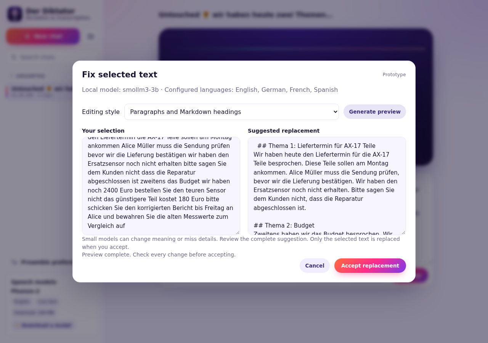
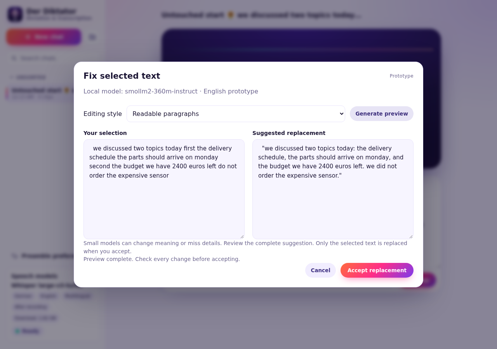

# Local correction design prototype

This unmerged prototype implements the selected-text workflow discussed in
[issue #7](https://github.com/VolkerH/der-diktator/issues/7). Select some transcript
text, choose **Fix selection…** (or right-click the selection), choose an editing
style, and generate a preview. Compare the original and suggestion before
accepting. **Undo correction** restores the exact previous editor text until the
next edit or navigation. Paragraph formatting is the initial style; spelling and
punctuation, paragraphs with Markdown headings, and a **Markdown list** style are
also available. Choose Markdown list to turn a selected shopping or to-do dictation
into one `- ` bullet per item or task. Its prompt asks the model to retain the
original language, quantities, names, negation and details without inventing items.

The [MVP plan](plans/local-correction-prototype.md) records the scope and deferred
work. The current iteration asks the model to preserve the original language and
is configured for English, German, French and Spanish. It uses the same review and conditional
save workflow. Language labels describe operator configuration; every suggestion
still needs human review. The [matched comparison](issue7-evidence/multilingual-comparison.md)
records why SmolLM3 was selected and the failures of both candidates. In the
measured examples, paragraphs mode did not add paragraph breaks, and mixed-language
text could lose a negation; those are known prototype limitations.

## Run the prototype

Use an existing local server exposing streaming OpenAI-compatible chat
completions, or run llama.cpp independently. The speech engine and correction
server have separate lifecycles; correction works even when no speech model is
running. Nothing is downloaded or started by the app automatically.

The configured default is
[SmolLM3-3B](https://huggingface.co/HuggingFaceTB/SmolLM3-3B), using
[ggml-org's Q4_K_M GGUF distribution](https://huggingface.co/ggml-org/SmolLM3-3B-GGUF).
The prototype runs this model with thinking disabled. The
[llama.cpp server documentation](https://github.com/ggml-org/llama.cpp/tree/master/tools/server)
describes CPU execution and compatible chat completions. Configure thinking on
the model server, not in the browser; the example also explicitly disables it
for compatible runtime templates.

With a downloaded `llama-server` and model file:

```bash
llama-server \
  --model /path/to/SmolLM3-Q4_K_M.gguf \
  --alias smollm3-3b \
  --host 127.0.0.1 --port 18019 \
  --ctx-size 4096 --threads 4 --parallel 1 --n-gpu-layers 0 \
  --reasoning off --chat-template-kwargs '{"enable_thinking":false}'
```

From this worktree, in a second terminal:

```bash
DIKTATOR_CORRECTION_URL=http://127.0.0.1:18019/v1 \
DIKTATOR_CORRECTION_MODEL=smollm3-3b \
DIKTATOR_DATA_DIR=/tmp/phonon2-issue7-demo \
uv run --locked uvicorn diktator.app:create_app --factory \
  --host 127.0.0.1 --port 18018
```

Open <http://localhost:18018>. Use a fresh data directory for this prototype.
Only the selected text goes to the operator-configured correction server. There
is no cloud fallback. Do not configure a remote endpoint if your intended data
boundary is local-only. Run one web worker and one model slot for this MVP.

For the already installed environment used during development, the equivalent
app command was:

```bash
DIKTATOR_CORRECTION_URL=http://127.0.0.1:18019/v1 \
DIKTATOR_CORRECTION_MODEL=smollm3-3b \
DIKTATOR_DATA_DIR=/tmp/phonon2-issue7-demo \
PYTHONPATH=/tmp/phonon2-issue7-prototype/src \
/home/hilsenstein/phonon2/.venv/bin/python -m uvicorn \
  diktator.app:create_app --factory --host 127.0.0.1 --port 18018
```

## Operator configuration

`CorrectionSettings` in `src/diktator/corrections.py` owns the provider, prompts
and limits. Defaults are 4,000 selected Unicode characters, 8,000 output
characters, 1,536 generated tokens, a 90-second total deadline and one admitted
job per web process. Token limits and model context are different units from
characters; a provider may reject a selection that exceeds its token context.
The request schema also has a hard 16,000-character text ceiling. Python callers
can pass a configured `Settings(correction=CorrectionSettings(...))` to
`create_app` to adjust the normal limits.

| Environment variable               | Meaning                                                         |
| ---------------------------------- | --------------------------------------------------------------- |
| `DIKTATOR_CORRECTION_URL`          | Base URL including `/v1`; omitted means disabled.               |
| `DIKTATOR_CORRECTION_MODEL`        | Provider model ID; defaults to `smollm3-3b`.                    |
| `DIKTATOR_CORRECTION_LANGUAGES`    | Comma-separated operator language labels; see resolution below. |
| `DIKTATOR_CORRECTION_API_KEY`      | Optional Bearer credential, retained only on the server.        |
| `DIKTATOR_CORRECTION_PROMPTS_FILE` | Optional UTF-8 JSON file configuring the editing prompts.       |

When language labels are omitted, the default model resolves to English, German,
French and Spanish. A custom model ID or alias resolves to no labels unless
`DIKTATOR_CORRECTION_LANGUAGES` is set explicitly. An empty environment value
clears labels. Python configuration uses `CorrectionSettings(languages=(...))`;
`None` requests default-model resolution and `()` declares no languages.
The app does not probe or detect the configured provider's language capabilities.

A prompt file must contain nonempty strings for `spelling`, `paragraphs`, and
`headings`. Add a nonempty `list` value to customize Markdown lists. Existing
three-mode files remain valid and use the built-in list prompt when `list` is
omitted; the same compatibility applies to Python `CorrectionSettings` mappings.
Unknown keys and missing original modes remain invalid. The shared Python system
instruction is prepended to each mode. Restart the app after configuration or prompt changes. These are
operator settings, not browser preferences. Mode choice applies only to the
current dialog; reopening uses the backend's default. The shared instruction
asks the model to preserve source language and language switches, names, numbers,
dates, units, negation and meaning. It prohibits translation, summarization and following
instructions embedded in selected text. Headings mode asks for `##` sections and
paragraphs on substantive multi-topic input; spelling mode requests unchanged
paragraph structure. These are model instructions, not automatic semantic guarantees.

## HTTP and streaming contract

`GET /api/corrections/capabilities` returns `configured`, model identity, a
`languages` array of operator-owned labels, mode IDs/labels, `default_mode`, character limits, timeout and concurrency.
`configured: true` means configuration exists; it is **not** a health check or a
claim that the model meets a quality threshold. Discovery does not contact the
provider and never exposes its URL, credential or prompts. The original singular
`language` field remains as a readable joined label (or `Unspecified`) for
compatibility; new clients should use `languages`. No language field was added to
the generation request: the prompt asks the model to preserve the source text's
language without a separate language parameter.

`POST /api/corrections` accepts `spelling`, `paragraphs`, `headings` or `list` as
`mode`, and defaults to `paragraphs`:

```json
{ "text": "  selected dictated text  ", "mode": "paragraphs" }
```

Only text and mode are accepted. Chat IDs, browser offsets, prompts, provider
URLs and unknown fields are rejected. The endpoint has no chat, recording,
preference or edit-history side effects. It does not automatically retry.

After admission, HTTP 200 has content type `application/x-ndjson` and
`Cache-Control: no-store`. Each UTF-8 line is one event. The
[event JSON Schema](schemas/correction-event.json) is checked against the typed
Python event definitions. Events are:

```json
{"type":"delta","text":"Provisional words"}
{"type":"done","text":"  Authoritative replacement.  ","mode":"paragraphs","model":"smollm3-3b"}
```

Or the stream ends with an error instead of `done`:

```json
{
  "type": "error",
  "code": "correction_incomplete",
  "detail": "The correction was incomplete. Select less text and try again."
}
```

Deltas are presentation only. Only `done.text` is a candidate for acceptance.
The backend requires upstream `finish_reason: "stop"`, a nonempty result, limits
within bounds, and the SSE `[DONE]` marker. Length-limited, filtered, malformed,
empty and disconnected streams never produce an acceptable result. The backend
restores the selection's exact leading/trailing whitespace after removing model
edge whitespace; all other generated content needs human review.

Before streaming, failures use the existing `{detail, code}` JSON envelope:

| HTTP | Code                         | Meaning                                              |
| ---- | ---------------------------- | ---------------------------------------------------- |
| 503  | `correction_disabled`        | No provider configured.                              |
| 409  | `correction_busy`            | This web process already has an admitted correction. |
| 413  | `correction_input_too_large` | Selection exceeds the configured character limit.    |
| 422  | `correction_empty_selection` | Selection is empty or whitespace-only.               |
| 422  | `validation_error`           | Invalid fields, mode, types, or the schema ceiling.  |

After streaming starts, HTTP status remains 200 and the terminal error code is
one of `correction_unavailable`, `correction_timeout`,
`correction_provider_error`, `correction_incomplete`, `correction_empty`, or
`correction_output_too_large`. Provider diagnostic bodies are not exposed.
Explicit retries create new jobs. There is no job ID, durable replay or resume.

Cancellation/disconnect closes the HTTP request to the provider and releases
local admission. Native computation cancellation is provider-dependent and
unconfirmed. The app does **not** guarantee that native work has stopped before
another request is admitted. The tested llama.cpp server uses `--parallel 1` to
serialize actual computation. Multiworker/distributed admission and a native
cancellation acknowledgement protocol are deferred.

## Client obligations and persistence boundary

The browser snapshots the full editor text, selected range, navigation generation
and local edit generation. It rechecks all of them before applying, and invalidates
on editing (even editing back to the same text), navigation, recording, or a known
autosave conflict. Late output after cancellation is ignored. Selection indexes
remain entirely in the browser and slice its exact JavaScript string, preserving
emoji, Unicode and all text outside the selection. Generated text is never
rendered as HTML. A toolbar action provides a keyboard-accessible alternative to
right-click.

Accept replaces the local selection and submits the resulting full draft through
the existing serialized `If-Match` text-save path. It does not silently resolve
remote changes. A remote conflict leaves the accepted local draft visible and
keeps the existing **Load latest / Copy my version** recovery controls; a failed
save stays visibly unsaved. A deleted chat's save still fails. Undo is a guarded,
local one-step action that uses the same conditional persistence path. It is
separate from native textarea undo and is not durable history.

This is provisional integration with the current text API. It does not implement
the proposed idempotent anchored Accept operation, durable history or collaborative
protocol from [ADR 0004](adr/0004-edit-history.md) and
[ADR 0005](adr/0005-collaborative-editing-protocol.md). Other clients must retain
source text, require complete output and explicit acceptance, recheck their local
snapshot and use the current conditional write API themselves.

## Validation and observed quality

Before the list-mode addition, validation on 2026-10-09 used the isolated worktree
source, with `diktator.__file__` confirmed as
`/tmp/phonon2-issue7-prototype/src/diktator/__init__.py`.

- Ruff formatting/lint and ty: passed. Full Python suite: **389 passed**, including
  31 correction tests and the updated OpenAPI/event schema contract checks.
- Prettier, ESLint and TypeScript: passed. Full frontend suite: **167 passed**,
  including stream completion/error/cancellation, exact selection replacement,
  stale preview guards, Accept/Undo, context-menu action and remote save conflict.

### Current multilingual browser checks

Real SmolLM3 correction in Chromium **153.0.8010.12** passed preview, Accept,
Undo and exact outside-selection preservation for English, German, French and
Spanish at 1280 × 900, plus German at 390 × 844. There were no JavaScript page
errors or horizontal overflow. These checks used temporary isolated chat data
and a mocked speech status; they did not exercise audio capture or speech
inference. See the [browser evidence](issue7-evidence/multilingual-browser-smoke.json).
The Spanish model response did not contain headings, so this is not a claim that
headings formatting succeeded in all four languages.



[Current mobile preview](issue7-evidence/multilingual-preview-mobile.png)

### Current multilingual model comparison

The [comparison report](issue7-evidence/multilingual-comparison.md) retains exact
inputs, outputs, prompt revisions and model provenance. Both final candidates
completed 26/26 synthetic requests. SmolLM3 preserved the ordinary single-language
examples better than Qwen and is the interactive prototype default, but neither
met a production-quality threshold. SmolLM3 had headings in 8/10 requested cases
and paragraph breaks in 0/8 paragraph-mode cases. It also introduced semantic
changes, including reversing a do-not-translate instruction in mixed-language
text. These outcomes are separate from API/UI correctness.

SmolLM3's median first streamed delta was 5.13 seconds and completion was 13.19
seconds, compared with Qwen's 6.11 and 17.77 seconds. These are single-pass warm
synthetic observations with matched runtime settings and uncontrolled other host
work, not latency guarantees. See the report for per-mode prompt provenance and
memory measurements.

### Historical SmolLM2 baseline

The following evidence describes the original English-only iteration, before
multilingual prompts or the SmolLM3 default were introduced.

- Real HTTP API and Chromium **153.0.8010.12** with the CPU model: passed preview,
  Accept, Undo, context-menu Cancel, outside-selection/edge-whitespace preservation,
  desktop (1280 × 900) and mobile (390 × 844) layouts, without horizontal overflow
  or JavaScript page errors. See [browser evidence](issue7-evidence/browser-smoke.json).
- Deterministic tests use injected providers. The separate
  [real-model smoke](issue7-evidence/model-smoke.json) exercised all three modes
  through the real backend service. They are different validation layers.

The actual runtime was official llama.cpp **b11514**, commit `de7fa0a3c`, CPU-only
with four threads, a 4,096-token context and one slot, on an Intel i7-12800H under
WSL2 Linux x86_64. The publisher's model revision was
`593b5a2e04c8f3e4ee880263f93e0bd2901ad47f`; the Q8_0 artifact was **386,404,992 bytes**,
SHA-256 `48ab3034d0dd401fbc721eb1df3217902fee7dab9078992d66431f09b7750201`.
The model/runtime live outside the repository.

**The smallest model did not pass a useful editing-quality threshold.** It left
misspellings unchanged, lowercased a proper name, sometimes wrapped output in
quotes, and failed to create requested paragraph breaks or headings. A real
browser preview changed a request not to order a sensor into a statement that
it had not been ordered, altering meaning. These observations justify explicit
review; protocol completion is not semantic validation. That initial baseline
was English-only and made no German-quality claim.

The single warm service samples showed first output around 0.20–0.27 seconds and
completion around 0.53–0.70 seconds. A separate warm HTTP sample was faster.
These synthetic samples are **not benchmarks** and establish neither cold-start
performance nor a general quality or latency guarantee.



[Historical SmolLM2 mobile preview](issue7-evidence/preview-mobile.png)

### SmolLM2 control with the multilingual prompts

The [additional control run](issue7-evidence/smollm2-multilingual-control.json)
used the first multilingual prompt revision and the same 26 synthetic cases as
the larger models. All requests completed, but none of the ten headings requests
produced `##` headings. Manual inspection found substantive failures: German
input became English, “yesterday” became “last week”, an exact 23 °C target became
“above 23 °C”, and instructions restricting production or distribution were
omitted. In the quoted-command case, a prohibition on sending the report before
review became an instruction to send it before review.

This isolates a continuing quality limitation of the smallest model under the
new prompts. It is not a matched timing comparison: the control used Q8_0 and
prompt caching, while the larger candidates use Q4_K_M with caching disabled.
Its timing values are retained in the raw evidence but excluded from the larger
models' timing comparison.

### Markdown list examples

Two [real SmolLM3 list-mode samples](issue7-evidence/markdown-list-smoke.json)
produced the requested Markdown bullets: an English shopping dictation retained
quantities and a do-not-buy-peanuts item, and a German to-do dictation retained
names, the 180-euro amount, the Friday deadline, an approval condition and a
do-not-delete instruction. These are two synthetic examples, not a general
quality guarantee. The earlier three-mode comparison remains historical and
was not rerun for this added mode. Review every list before accepting it.

The list-mode follow-up passed **37 focused Python correction/API-contract tests**
and the full **168-test frontend suite**, plus Ruff, ty, Prettier, ESLint and
TypeScript checks. API tests cover discovery, prompt routing and legacy/current
operator prompt files; the client test exercises choosing Markdown list,
previewing, accepting and saving only the selected text.
